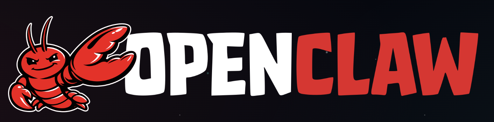

<p align="center">
  
</p>

<h1 align="center">OpenClaw</h1>

<p align="center">
  <strong>AI-Powered Voice Conversation iOS App</strong><br>
  Built with SwiftUI and ElevenLabs Conversational AI SDK
</p>

<p align="center">
  
  
  
  
</p>

---

## Overview

OpenClaw is a native iOS application that enables real-time voice conversations with AI agents powered by [ElevenLabs Conversational AI](https://elevenlabs.io/docs/conversational-ai). The app features a modern, immersive UI design with smooth animations, secure credential storage, and support for both public and private ElevenLabs agents.

## Features

- **Real-time Voice Conversations** - Talk naturally with AI agents using WebRTC technology
- **Text Messaging** - Optional text input for when voice isn't convenient
- **Private Agent Support** - Securely connect to private ElevenLabs agents with API key authentication
- **Live Transcription** - See conversation transcripts in real-time
- **Animated Voice Visualizer** - Beautiful orb animation that responds to agent state
- **Secure Credential Storage** - API keys stored safely in iOS Keychain
- **Network Monitoring** - Automatic detection of connectivity status
- **Dark Mode Design** - Elegant warm-toned dark interface

---

## Architecture

OpenClaw follows a clean MVVM (Model-View-ViewModel) architecture with clear separation of concerns.

```
OpenClaw/
├── App/
│   └── AppState.swift              # Global application state
├── Extensions/
│   └── Color+Theme.swift           # Color palette and theming
├── Features/
│   ├── Conversation/
│   │   ├── ConversationView.swift      # Main conversation UI
│   │   ├── ConversationViewModel.swift # Conversation business logic
│   │   ├── MessageBubbleView.swift     # Chat message component
│   │   └── OrbVisualizerView.swift     # Animated voice visualizer
│   └── Settings/
│       ├── SettingsView.swift          # Settings UI
│       └── SettingsViewModel.swift     # Settings business logic
├── Models/
│   └── ConversationTypes.swift     # Data models and types
├── Services/
│   ├── AudioSessionManager.swift   # Audio session configuration
│   ├── ConversationManager.swift   # ElevenLabs SDK wrapper
│   ├── KeychainManager.swift       # Secure credential storage
│   ├── NetworkMonitor.swift        # Connectivity monitoring
│   └── TokenService.swift          # API token management
├── Assets.xcassets                 # Images, colors, app icon
└── OpenClawApp.swift               # App entry point
```

### Key Components

| Component | Responsibility |
|-----------|----------------|
| **ConversationManager** | Singleton that wraps the ElevenLabs SDK, manages conversation lifecycle, and publishes state changes |
| **TokenService** | Handles authentication with ElevenLabs API for private agents |
| **KeychainManager** | Securely stores and retrieves API keys and agent IDs |
| **NetworkMonitor** | Monitors network connectivity using NWPathMonitor |
| **AudioSessionManager** | Configures AVAudioSession for voice conversations |

### Data Flow

```
┌─────────────────┐     ┌──────────────────┐     ┌─────────────────┐
│  ConversationView │ ←→ │ ConversationViewModel │ ←→ │ ConversationManager │
└─────────────────┘     └──────────────────┘     └─────────────────┘
                                                           ↓
                                                 ┌─────────────────┐
                                                 │  ElevenLabs SDK │
                                                 │    (LiveKit)    │
                                                 └─────────────────┘
```

---

## Requirements

- **iOS 17.0** or later
- **Xcode 15.0** or later
- **Swift 5.9** or later
- **ElevenLabs Account** with a configured AI agent

---

## Installation

### Step 1: Clone the Repository

```bash
git clone https://github.com/yourusername/OpenClaw.git
cd OpenClaw
```

### Step 2: Open in Xcode

```bash
open OpenClaw.xcodeproj
```

### Step 3: Install Dependencies

The project uses Swift Package Manager. Xcode will automatically resolve dependencies when you open the project.

**Dependencies:**
- [ElevenLabs Swift SDK](https://github.com/elevenlabs/elevenlabs-swift-sdk) - Conversational AI SDK
- LiveKit (transitive dependency) - WebRTC infrastructure

### Step 4: Configure Signing

1. Select the **OpenClaw** target in Xcode
2. Go to **Signing & Capabilities**
3. Select your **Team**
4. Update the **Bundle Identifier** if needed

### Step 5: Build and Run

1. Select your target device or simulator
2. Press `Cmd + R` to build and run

---

## Configuration

### Setting Up Your ElevenLabs Agent

1. Go to [ElevenLabs](https://elevenlabs.io) and create an account
2. Navigate to **Conversational AI** section
3. Create a new agent or use an existing one
4. Copy your **Agent ID**

### Configuring the App

1. Launch OpenClaw on your device
2. Tap the **gear icon** to open Settings
3. Enter your **Agent ID**
4. For private agents:
   - Enable **Private Agent** toggle
   - Enter your **API Key** (requires `convai_write` permission)
5. Tap **Save**
6. Use **Test Connection** to verify your configuration

### API Key Permissions

For private agents, your API key needs the following permission:
- `convai_write` - Required for generating conversation tokens

Generate a new API key at [ElevenLabs API Keys](https://elevenlabs.io/app/settings/api-keys) with the appropriate permissions.

---

## Usage

### Starting a Conversation

1. Ensure your agent is configured in Settings
2. Tap the **coral waveform button** to start
3. Grant microphone permission when prompted
4. Start speaking - the agent will respond

### Controls

| Control | Action |
|---------|--------|
| **Waveform Button** | Start/stop conversation |
| **Microphone Button** | Mute/unmute your voice |
| **Keyboard Button** | Toggle text input mode |

### Voice States

The orb visualizer indicates the current state:
- **Pulsing** - Agent is listening
- **Active animation** - Agent is speaking
- **Static** - Disconnected

---

## Troubleshooting

### Connection Timeout

If you see "Timed out" errors:
- Check your internet connection
- Verify your Agent ID is correct
- For private agents, ensure your API key has `convai_write` permission

### No Audio

If you can't hear the agent:
- Check your device volume
- Ensure the app has microphone permission
- Try restarting the conversation

### 401 Authentication Error

For private agents:
- Regenerate your API key with `convai_write` permission
- Verify the API key is saved correctly in Settings

---

## Tech Stack

| Technology | Purpose |
|------------|---------|
| **SwiftUI** | Declarative UI framework |
| **Combine** | Reactive state management |
| **ElevenLabs SDK** | Conversational AI integration |
| **LiveKit** | WebRTC infrastructure |
| **Security.framework** | Keychain credential storage |
| **Network.framework** | Connectivity monitoring |
| **AVFoundation** | Audio session management |

---

## License

This project is licensed under the MIT License - see the [LICENSE](LICENSE) file for details.

---

## Acknowledgments

- [ElevenLabs](https://elevenlabs.io) for the Conversational AI SDK
- [LiveKit](https://livekit.io) for WebRTC infrastructure

---

<p align="center">
  Made with ❤️ for AI-powered voice interactions
</p>
